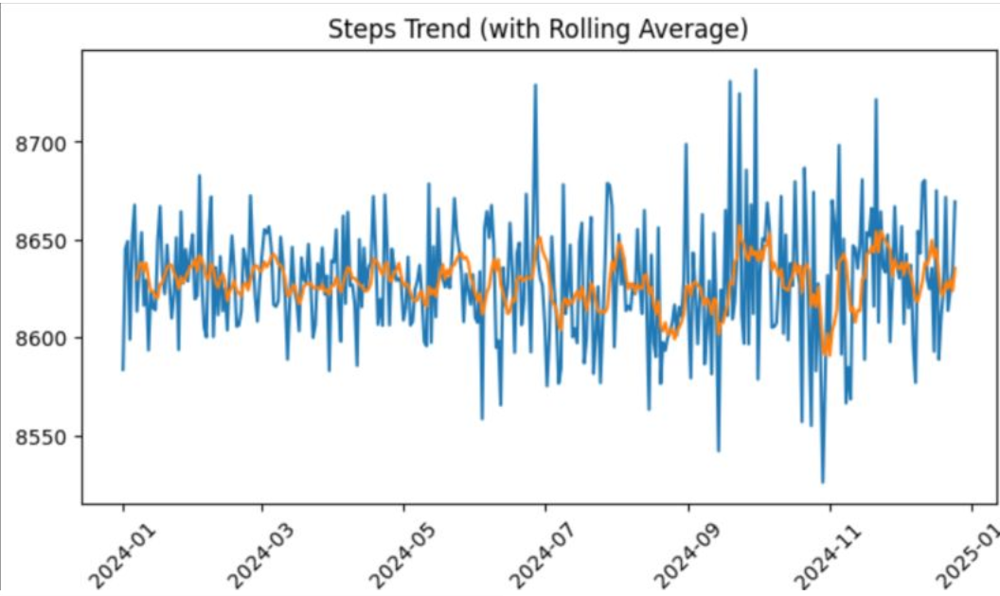
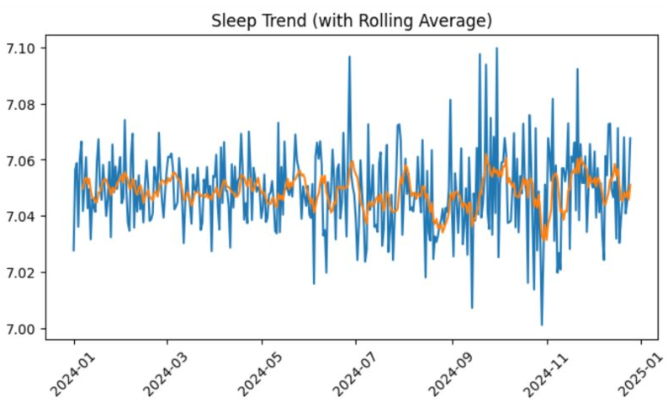
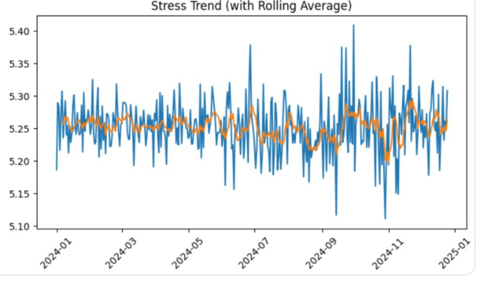

# 📊 Health & Fitness Data Analysis Project

End-to-end health & fitness data analysis project using **Python**, covering segmentation, trend analysis, KPI design, and data storytelling.

---

## 🎯 Objectives

* Analyze user behavior across **activity, sleep, and stress**
* Identify **low-performance and high-risk user groups**
* Build **KPIs** to measure health and wellness
* Generate **actionable insights** for better lifestyle decisions

---

## 📊 Key Features

* User Segmentation (Activity, Recovery, Risk)
* Cohort Analysis
* Trend Analysis (Rolling Averages)
* Outlier Detection (IQR Method)
* KPI Design:

  * Wellness Score
  * Recovery Index
  * Activity Efficiency
* Data Storytelling using visualizations

---

## 📈 Key Insights

* Majority of users fall into **low activity and low recovery segments**
* **Sleep and stress** are the primary drivers of overall wellness
* Most users are in the **low to moderate wellness category**
* Dataset contains **missing values and extreme outliers**, impacting reliability

---

## 📊 Visual Insights

### Steps Trend



### Sleep Trend



### Stress Trend



---

## 🛠 Tools Used

* Python
* Pandas
* Matplotlib

---

## 📁 Project Structure

```
Health-Fitness-Data-Analysis/
│
├── data/
├── notebooks/
├── images/
└── README.md
```

---

## 🚀 Conclusion

This project demonstrates a complete **end-to-end data analysis workflow** — from raw data preprocessing to insight generation and KPI design — enabling data-driven decision-making in health and fitness domains.

---

## 🔗 Future Improvements

* Build interactive dashboard (Streamlit / Power BI)
* Apply machine learning models for prediction
* Add real-time data tracking

---

#️⃣ #DataScience #Python #DataAnalysis #Analytics #LearningInPublic
